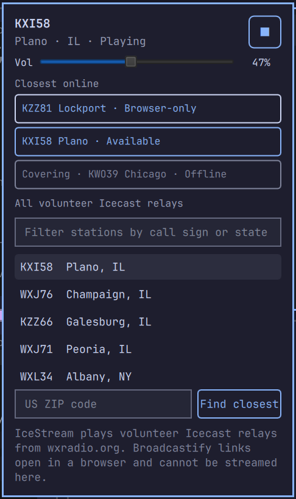

# IceStream

Volunteer Icecast relays of NOAA Weather Radio in the Omarchy bar.

Directly stream broadcasts from [wxradio.org](https://wxradio.org). If a transmitter has no wxradio stream, IceStream may offer a [Broadcastify](https://www.broadcastify.com) listen page. Those must be used in a browser; they cannot be streamed inside the plugin.

This is **not** a dedicated NOAA Weather Radio receiver and is not for protection of life or property. Only a subset of NWR transmitters have a volunteer Icecast mount.



## Install

Omarchy 4. Review the source, then:

```sh
omarchy plugin add https://github.com/JohnicBoom/IceStream.git --enable
```

Runtime needs **mpv** and **curl** (both ship with Omarchy).

## Use

- Left-click the bar radio: open or close the popover
- Right-click: play/stop
- Middle-click, or opening the panel: locate from the Omarchy weather coordinates when those are set
- ZIP field: 5-digit US ZIP if you want a different place
- Space or the stop square: stop while playing (pick an Available stream to start)
- Escape: close
- **Available**: play in IceStream
- **Browser-only**: opens Broadcastify in the browser
- **Offline**: no Icecast and no live Broadcastify page

Closing the panel does not stop audio. Right-click the bar or press stop.

Volume in the popover is IceStream-only, so other apps can stay louder.

## Develop

```sh
cd IceStream
node --test tests/*.test.mjs
omarchy plugin validate .
```

Node is only for tests. `bash scripts/check.sh` runs tests and `omarchy plugin validate`.

## Remove

```sh
omarchy plugin remove io.github.johnicboom.icestream
rm -rf ~/.local/state/icestream ~/.cache/icestream
```
