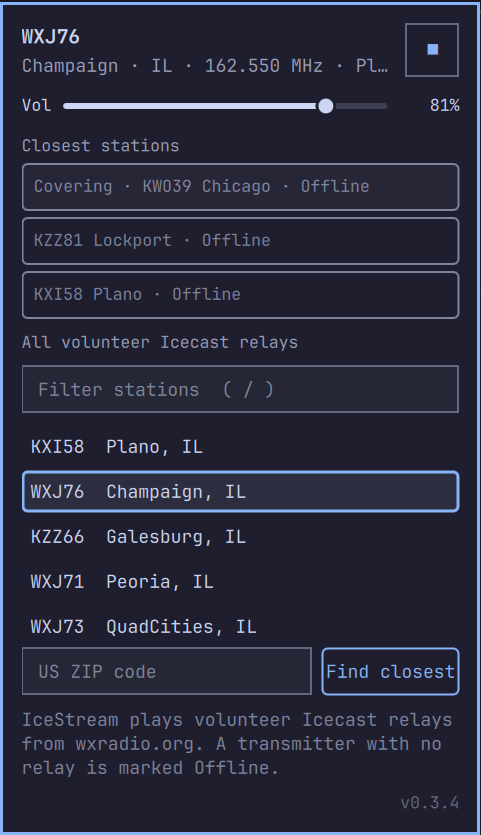

# IceStream

Volunteer Icecast relays of NOAA Weather Radio in the Omarchy bar.

Directly stream broadcasts from [wxradio.org](https://wxradio.org). If a transmitter has no wxradio stream, IceStream may offer a [Broadcastify](https://www.broadcastify.com) listen page. Those must be used in a browser; they cannot be streamed inside the plugin.

This is **not** a dedicated NOAA Weather Radio receiver and is not for protection of life or property. Only a subset of NWR transmitters have a volunteer Icecast mount.



## Install

Omarchy 4. Review the source, then:

```sh
omarchy plugin add https://github.com/JohnicBoom/IceStream.git --enable
```

Runtime needs **mpv** and **curl** (both ship with Omarchy). IceStream runs its own mpv with `--no-config`, so your personal mpv settings and scripts do not affect it.

## Update

```sh
omarchy plugin update com.johnicboom.icestream
omarchy restart shell
```

Omarchy keeps running the previous IceStream code until the shell restarts, so the new version only takes effect after `omarchy restart shell`. From 0.3.0 on, the bar tooltip and popover say when a restart is needed. The popover chip restarts the shell when clicked, and the running version stays in the bottom-right corner.

## Use

- Left-click the bar radio: open or close the popover
- Right-click: play/stop
- Middle-click, or opening the panel: locate from Omarchy weather coordinates, or the same IP city weather shows before you set one
- ZIP field + **Find closest**: 5-digit US ZIP if you want a different place
- Space: play/stop (the last station)
- Up/Down or j/k: move through Closest stations and the relay list; Enter plays the highlighted row
- `/`: filter the relay list (Esc or Down goes back to the list)
- The stop button: stop while playing
- Escape: close

**Closest stations** lists the transmitter NWS says covers you plus every other transmitter NOAA lists for your county, working options first, then nearest tower. Each row is marked:

- **Available**: plays in IceStream
- **Browser-only**: opens the Broadcastify listen page in your browser
- **Offline**: no stream and no live listen page (clicking says so)

Below that, the full list of volunteer relays can be filtered by call sign, site, or state.

Closing the panel does not stop audio. Right-click the bar or press stop.

Volume in the popover is IceStream-only, so other apps can stay louder. It is remembered across restarts.

## Develop

```sh
cd IceStream
node --test tests/*.test.mjs
omarchy plugin validate .
```

Node is only for tests. `bash scripts/check.sh` runs tests, `omarchy plugin validate`, and qmllint. `bash scripts/integration.sh` drives the real service (mpv, live endpoints) in a throwaway Quickshell; it needs a graphical session and network, and plays at volume 0.

`node scripts/build-nwr-transmitters.mjs` regenerates the bundled NOAA transmitter list (`data/nwr-transmitters.json`).

## Remove

```sh
omarchy plugin remove com.johnicboom.icestream
rm -rf ~/.local/state/icestream
```
